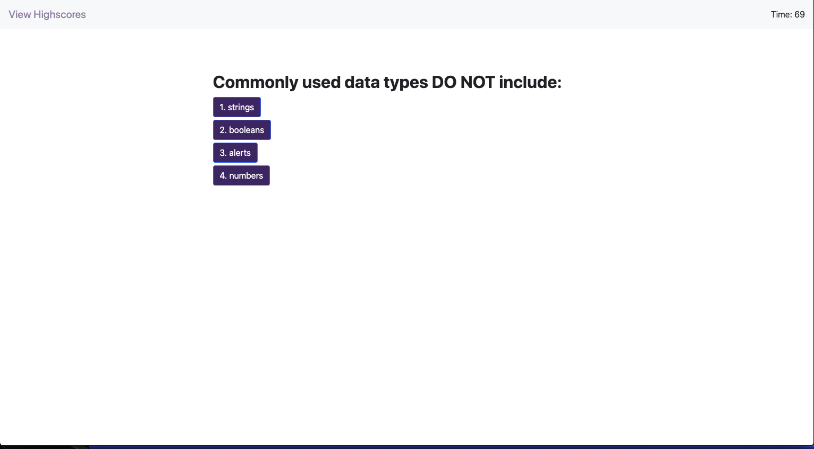
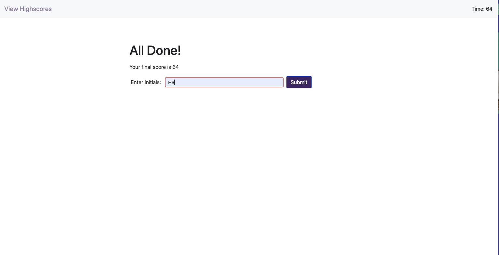

# code-quiz

## Summary
In this assignment, we were tasked with building out a timed coding quiz that stores high scores. I created my base `index.html` file with just a skeleton of the site. With the help of Javascript and DOM Manipulation I was able to build out the quiz to populate questions and answer choices dynamically. Once a user interacts with a button they move to the next question. If they get the question wrong, there timer reduces by 15 seconds. Once the user finishes the quiz, the time remaining is there total score and a new screen appears dynamically requesting input of the users initials. Once the user submits the initials their initials and scores are saved to the local storage.

## Instruction

Navigate to the following Github repository:
 
    https://github.com/hsaddanathan/code-quiz.git

Across the top of the page, click on the Fork button on the right.

Once you have done this, you will see the repo copied within your Github account

Click the Green "Code" Button, and copy repo link. 

Open Terminal and run "git clone (Paste Link Here)"

Once repo has been cloned, you can run " code ." to open in Visual Studio Code. 

From there, right click and select "Open in Default Browser" to preview the page, or you can inspect the code from Visual Studio Code.

Alternatively, if you would like to only view the page please reference:
    https://hsaddanathan.github.io/code-quiz/

## Deployed Site Images

Image depicts landing page

Image shows quiz questions

Image shows user score and submission 

Image shows scoreboard

## Links

student-portfolio repository link:
    https://github.com/hsaddanathan/code-quiz.git

Github Deployed Site URL:
    https://hsaddanathan.github.io/code-quiz/

## Contributors 
[@hsaddanathan](https://github.com/hsaddanathan)

